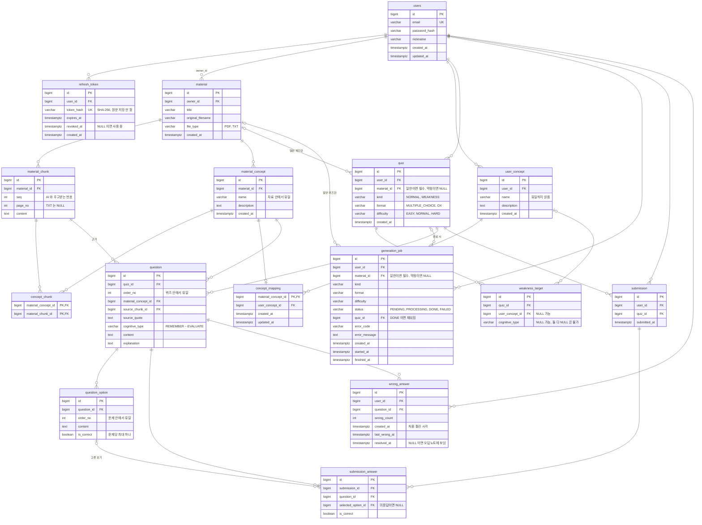

# ERD

스키마가 바뀌는 마이그레이션을 추가할 때 이 문서도 같이 고친다. 기준 마이그레이션: `V1__init.sql`

## 덩어리별 설명

| 덩어리 | 테이블 | 역할 |
| --- | --- | --- |
| 사용자 | `users`, `refresh_token` | 이메일 로그인과 JWT Refresh Token. 토큰은 재발급 때마다 새 행을 만들고 옛 행은 `revoked_at` 으로 무효화해 탈취를 감지한다 |
| 자료 | `material`, `material_chunk` | 원본 파일은 보관하지 않고 추출한 텍스트를 페이지(청크) 단위로 저장한다 |
| 개념 | `material_concept`, `concept_chunk`, `user_concept`, `concept_mapping` | 자료에서 뽑힌 개념(사실)과 사용자의 대표 개념(판단)을 매핑으로 잇는다 |
| 퀴즈 | `quiz`, `weakness_target`, `generation_job`, `question`, `question_option` | 일반 퀴즈와 약점 퀴즈를 한 테이블에 두고, 약점 퀴즈의 대상만 따로 둔다. 생성은 비동기 작업이다 |
| 학습 | `submission`, `submission_answer`, `wrong_answer` | 풀이 기록과 오답노트. 약점 분석은 풀이 기록을 집계해 계산한다 |

## 설계 메모

- **삭제 정책: 사용자가 지워지면 그 사용자의 데이터가 모두 지워진다.** 모든 외래 키가 CASCADE 로 이어진다. 자료를 지우면 그 자료에서 나온 것(청크, 개념, 일반 퀴즈, 약점 퀴즈 안의 그 자료 문제)만 지워진다. `DeletePolicyTest` 가 두 경우를 검증한다. 테이블을 추가하면 그 테스트에도 추가한다.
- **개념은 두 단계다.** 문제는 바뀌지 않는 자료 개념에 연결되고, 분석은 대표 개념 기준이다. 매핑 행이 없는 자료 개념은 분석에서 자기 자신을 대표로 취급한다. 대표 개념 이름은 동명이의어가 있을 수 있어 유일하지 않다.
- **일반 퀴즈와 약점 퀴즈는 한 테이블이다.** 약점 퀴즈는 여러 자료에 걸칠 수 있어 `material_id` 가 NULL 이고, CHECK 로 종류와 맞춘다. 어느 자료에서 나왔는지는 문제 → 자료 개념 → 자료로 따라간다. 형식은 퀴즈 단위로만 저장한다.
- **OX 는 보기 두 개다.** 객관식과 OX 를 "고른 보기가 정답인가"로 같은 방식으로 채점한다. 정답 보기는 부분 유니크 인덱스로 문제당 최대 하나이고, 최소 하나인지는 애플리케이션이 검증한다.
- **점수는 저장하지 않고, 정답 여부는 저장한다.** 점수는 제출 하나의 답안을 세면 나온다. 정답 여부는 약점 분석이 모든 답안을 훑을 때 보기 테이블 join 을 없애고, 보기가 없는 단답형·서술형의 채점 결과를 담을 자리이기도 하다.
- **`updated_at` 은 DB 가 자동으로 바꾸지 않는다.** `DEFAULT now()` 는 INSERT 때만 적용되므로 UPDATE 하는 SQL 에서 직접 넣는다.
- **분석용 집계 테이블은 없다.** 사고 유형별 정답률과 약한 개념은 `submission_answer` + `question` + `concept_mapping` 을 바로 집계한다.

## 나중에 정할 것

- **MVP 2 에서 추가**: `user_concept` 임베딩(pgvector), `concept_mapping` 의 판단 주체와 이유, 단답형·서술형용 `question` 컬럼(모범 답안, 채점 기준)과 `submission_answer.answer_text`, `format` 값.
- **소셜 로그인을 붙이면**: `users` 에 가입 방식과 소셜 식별자를 추가하고 `password_hash` 의 NOT NULL 을 푼다.
- **자료 삭제 기능을 만들 때**: 매핑이 모두 사라진 대표 개념, 문제가 0개가 된 약점 퀴즈를 어떻게 할지, 지난 제출의 점수가 바뀌어도 되는지 정한다.
